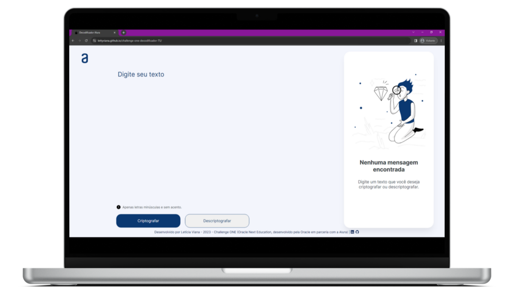
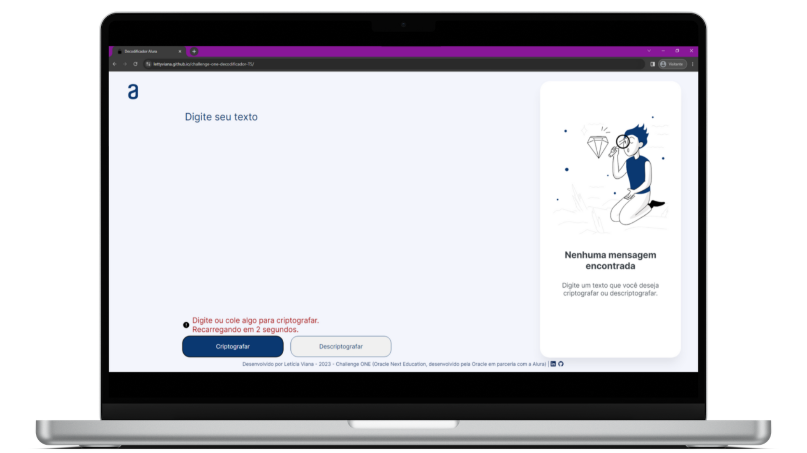
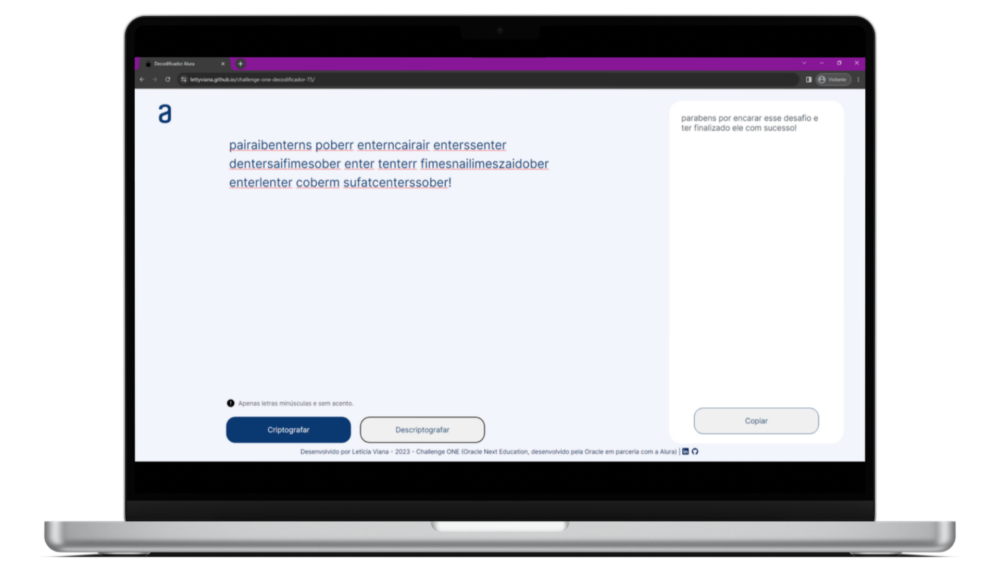
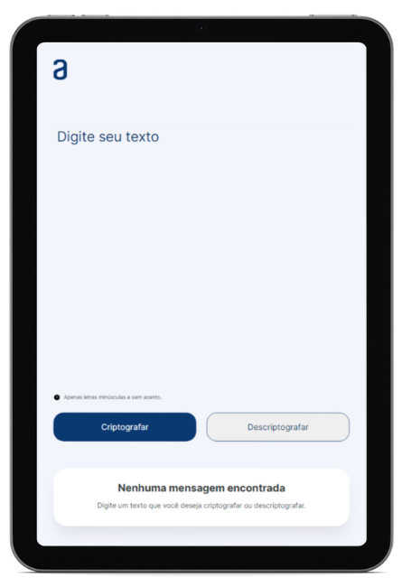
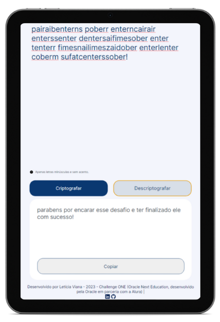
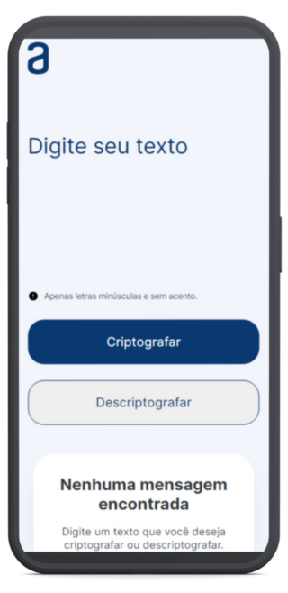
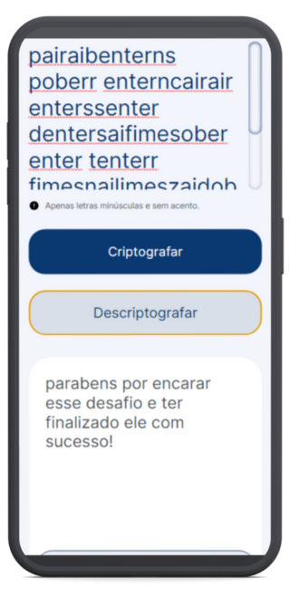

# **Decodificador de Mensagens (Challenge ONE)**

### **Projeto de Decodificador de Mensagens do Challenge ONE**

Desafio do Programa ONE - Oracle Next Education com a Alura, no qual recebemos a missão de criar um decodificador de textos, decidi fazer outra versão, tentando seguir o modelo disponibilizado no Figma.

    

#

## **Índice:**

1. [Requisitos](#1-requisitos) 
2. [Extras](#2-extras)
3. [Minhas implementações](#3-minhas-implementações)
4. [Tecnologias utilizadas](#4-linguagenstecnologias-utilizadas)
5. [Imagens do projeto](#5-imagens-do-projeto)
6. [Como usar](#6-como-usar)
7. [Autora e contato](#7-autora-e-contato)
8. [Licença](#8-licença)
9. [Status do Projeto](#9-status-do-projeto)

#

### **1. Requisitos**

Vamos trabalhar em uma aplicação que criptografa textos, assim você poderá trocar mensagens secretas com outras pessoas que saibam o segredo da criptografia utilizada.

A criptografia deve conter  as seguintes características:
- **As "chaves" de criptografia que utilizaremos são:**
    - A letra **"e"** é convertida para **"enter"**;
    - A letra **"i"** é convertida para **"imes"**;
    - A letra **"a"** é convertida para **"ai"**;
    - A letra **"o"** é convertida para **"ober"**;
    - A letra **"u"** é convertida para **"ufat"**;
- Deve funcionar apenas com letras minúsculas ✔️
- Não devem ser utilizados letras com acentos nem caracteres especiais ✔️
- Deve ser possível converter uma palavra para a versão criptografada e também retornar uma palavra criptografada para a versão original ✔️
- A página deve ter campos para inserção do texto a ser criptografado ou descriptografado, e a pessoa usuária deve poder escolher entre as duas opções ✔️
- O resultado deve ser exibido na tela ✔️

#

### **2. Extras**

- O resultado deve ser exibido na tela.
- Um botão que copie o texto criptografado/descriptografado para a área de transferência - ou seja, que tenha a mesma funcionalidade do ctrl+C ou da opção "copiar" do menu dos aplicativos. ✔️
- Além, é claro, de aprender/se habituar a mexer na ferramenta de organização/gestão Trello.

#

### **3. Minhas implementações**

Tentei manter as mesmas implementações do projeto anterior.

- Design responsivo para desktop (1920 x 1080/1440 x 1024), tablet (768 x 1174) e celular (375 x 933);
- Validação do texto inserido, de modo a permitir apenas letras minúsculas e caracteres sem acento. Caso o usuário insira algum desses, aparecerá um aviso na tela para que o usuário siga as instruções;
- Botão "Copiar" que só aparece após clicar em "Criptografar" ou "Descriptografar";
- Alerta após clicar no botão "Copiar".

#

### **4. Linguagens/tecnologias utilizadas**

 
    
    
    

 

#

### **5. Imagens do projeto**

     
     
     
    
    
    
    
    
    

#

### **6. Como usar**

Para acessar e decodificar suas mensagens, clique <a href="https://lettyviana.github.io/challenge-decodificador-one-T5/" target="_blank">aqui</a>.

#

### **7. Autora e contato**

#

### **8. Licença**

#

### **9. Status do projeto**

- [x] Funcional;
- [x] Responsivo (desktop (1920 x 1080/1440 x 1024), tablet (768 x 1174) e celular (375 x 933));
- [x] Concluído.
